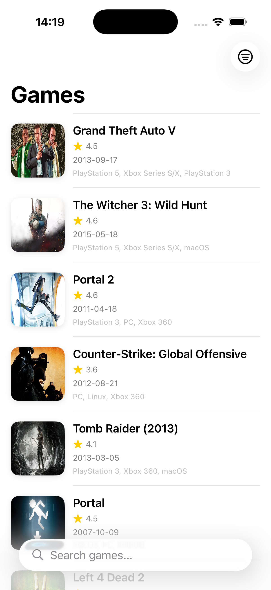
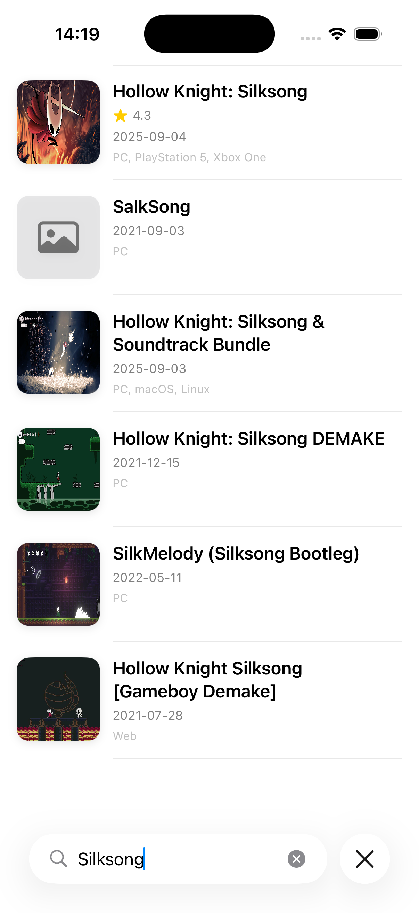
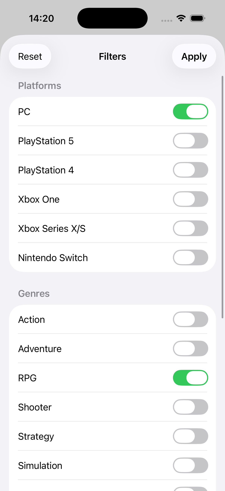

# RAWGKit Demo App

A complete iOS app demonstrating how to use RAWGKit's SwiftUI-first components and view models.

## Features

- 🎮 **Browse Games**: Explore 897K+ games from RAWG.io
- 🔍 **Search**: Real-time search with debouncing (300ms)
- 🎯 **Filters**: Platform, genre, and sorting options
- 📱 **Native UI**: SwiftUI with pull-to-refresh and infinite scrolling
- ⚡ **Smart Caching**: Fast data loading with automatic cache management
- 🎨 **iOS 15+ Support**: NavigationView, async/await, and modern SwiftUI

## Screenshots

> 📸 **Note**: Screenshots will be added once you run the app!
> 
> The demo app features:
> - Clean game list with thumbnails and ratings
> - Search bar with real-time filtering  
> - Filters sheet for platform, genre, and sorting
> - Pull-to-refresh and infinite scrolling





## Requirements

- iOS 15.0+
- Xcode 15.0+
- Swift 5.9+
- RAWG API Key (free at [rawg.io/apidocs](https://rawg.io/apidocs))

## Quick Start

1. **Get your API key** from [RAWG.io](https://rawg.io/apidocs)

2. **Configure the project**:
   ```bash
   cd Examples/RAWGKitDemo
   cp Config.xcconfig Config.local.xcconfig
   ```

3. **Add your API key** to `Config.local.xcconfig`:
   ```
   RAWG_API_KEY = your_actual_api_key_here
   ```

4. **Open and run**:
   ```bash
   open RAWGKitDemo.xcodeproj
   # Build and run in Xcode (⌘R)
   ```

## Configuration

The app uses a secure configuration system:

- **`Config.xcconfig`**: Template file with placeholder (committed to git)
- **`Config.local.xcconfig`**: Your actual API key (gitignored, never committed)
- **`Configuration.swift`**: Runtime access via `Bundle.main.object(forInfoDictionaryKey:)`

The API key is injected at build time and accessed securely at runtime. The app will show a helpful error message if the key is not configured.

## Security

- ✅ API key never hardcoded in source files
- ✅ `Config.local.xcconfig` excluded from git via `.gitignore`
- ✅ Build fails with clear error message if key is missing
- ✅ Template file (`Config.xcconfig`) provides clear setup instructions
- ✅ Runtime validation with helpful error messages

## Features Demonstrated

### ✅ GamesViewModel Integration
- **State Management**: ObservableObject pattern with @Published properties
- **Pagination**: Automatic load more on scroll
- **Search**: Debounced search with 300ms delay
- **Filters**: Platform, genre, and ordering filters
- **Error Handling**: Retry capability with user-friendly error messages
- **Pull to Refresh**: Native SwiftUI refreshable support

### ✅ Pre-built SwiftUI Components
- **GameImageView**: Async image loading with placeholder and error states
- **GameRowView**: Reusable list row with thumbnail, rating, and metadata
- **RatingBadgeView**: Color-coded rating display
- **View Extensions**: 
  - `.showError()` - Alert presentation for network errors
  - `.showEmptyState()` - Empty state with icon and message

### ✅ Views Included
- **ContentView**: Main games list with search and filters
- **FiltersView**: Modal sheet for platform, genre, and sort options
- **GameDetailView**: Full game details with description, screenshots, etc.

## Project Structure

```
RAWGKitDemo/
├── RAWGKitDemo.xcodeproj    # Xcode project
├── RAWGKitDemo/
│   ├── RAWGKitDemoApp.swift # App entry point
│   ├── ContentView.swift    # Main view with games list
│   └── Assets.xcassets      # App icons and colors
└── README.md               # This file
```

The project uses RAWGKit as a local package dependency (referenced from `../../`).

## Building the Project

This project automatically links to the local RAWGKit package. No additional setup needed - just open and run!

## Code Walkthrough

### Main List View
```swift
@StateObject private var viewModel = GamesViewModel(
    client: RAWGClient(apiKey: "your-api-key")
)

var body: some View {
    NavigationStack {
        List {
            ForEach(viewModel.games) { game in
                GameRowView(game: game)
                    .onTapGesture {
                        selectedGame = game
                    }
            }
        }
        .searchable(text: $viewModel.searchQuery)
        .refreshable {
            await viewModel.reloadGames()
        }
    }
}
```

### Pagination
```swift
GameRowView(game: game)
    .onAppear {
        if game == viewModel.games.last {
            Task {
                await viewModel.loadMore()
            }
        }
    }
```

### Error Handling
```swift
.showError(error: viewModel.error) {
    await viewModel.retry()
}
```

### Filters
```swift
viewModel.platformIDs = [4, 187, 18] // PC, PS5, PS4
viewModel.genreIDs = [4, 5] // Action, RPG
viewModel.ordering = GameOrdering.metacriticDescending.rawValue
await viewModel.reloadGames()
```

## Platform Support

- **iOS**: 15.0+
- **macOS**: 13.0+
- **tvOS**: 15.0+ (adjust UI for TV interface)
- **watchOS**: 8.0+ (requires simplified UI)

## Customization Tips

### Change Default Ordering
```swift
@StateObject private var viewModel: GamesViewModel = {
    let vm = GamesViewModel(client: RAWGClient(apiKey: "your-key"))
    vm.ordering = GameOrdering.ratingDescending.rawValue
    return vm
}()
```

### Add More Filters
```swift
viewModel.metacriticMin = 80 // Only highly-rated games
viewModel.year = 2024 // Only 2024 releases
viewModel.excludeAdditions = true // Hide DLC
```

### Custom Row Design
Create your own row view using the `Game` model:
```swift
struct MyCustomRow: View {
    let game: Game
    
    var body: some View {
        HStack {
            GameImageView(url: game.backgroundImage)
                .frame(width: 100, height: 100)
            
            VStack(alignment: .leading) {
                Text(game.name)
                if game.rating > 0 {
                    RatingBadgeView(rating: game.rating)
                }
            }
        }
    }
}
```

## Performance Considerations

### Caching
RAWGKit includes automatic response caching (default 5 minutes):
```swift
let client = RAWGClient(
    apiKey: "your-key",
    cacheDuration: 600 // 10 minutes
)
```

### Pagination Settings
Adjust page size for better performance:
```swift
let query = GamesQueryBuilder()
    .pageSize(20) // Default is 20, max is 40
    .execute(with: client)
```

### Image Loading
GameImageView uses AsyncImage with automatic placeholder and error handling. For more control, use a third-party image library like Kingfisher or SDWebImage.

## API Rate Limits

RAWG API free tier limits:
- **20,000 requests/month**
- **5 requests/second**

RAWGKit handles rate limiting automatically with exponential backoff retry.

## Next Steps

1. **Add Favorites**: Store favorite games using SwiftData or Core Data
2. **Offline Mode**: Cache full game details for offline viewing
3. **Share Feature**: Let users share games via ShareLink
4. **Watchlist**: Track upcoming releases
5. **Platform-Specific Features**: Add widgets, App Clips, or Watch complications

## Troubleshooting

### "No Games Found"
- Check your API key is valid
- Verify internet connection
- Check RAWG API status at [status.rawg.io](https://status.rawg.io)

### Build Errors
- Ensure minimum deployment target is iOS 15.0+ or macOS 13.0+
- Verify RAWGKit is properly added as a Swift Package
- Clean build folder (Cmd+Shift+K) and rebuild

### Images Not Loading
- Check that games have `backgroundImage` URL
- Verify network permissions in Info.plist if needed
- Some games may not have images in the RAWG database

## Resources

- [RAWGKit Documentation](https://github.com/pespinel/RAWGKit)
- [RAWG API Documentation](https://api.rawg.io/docs/)
- [SwiftUI Documentation](https://developer.apple.com/documentation/swiftui/)

## License

This example code is provided as-is for educational purposes. Feel free to use it in your own projects.
